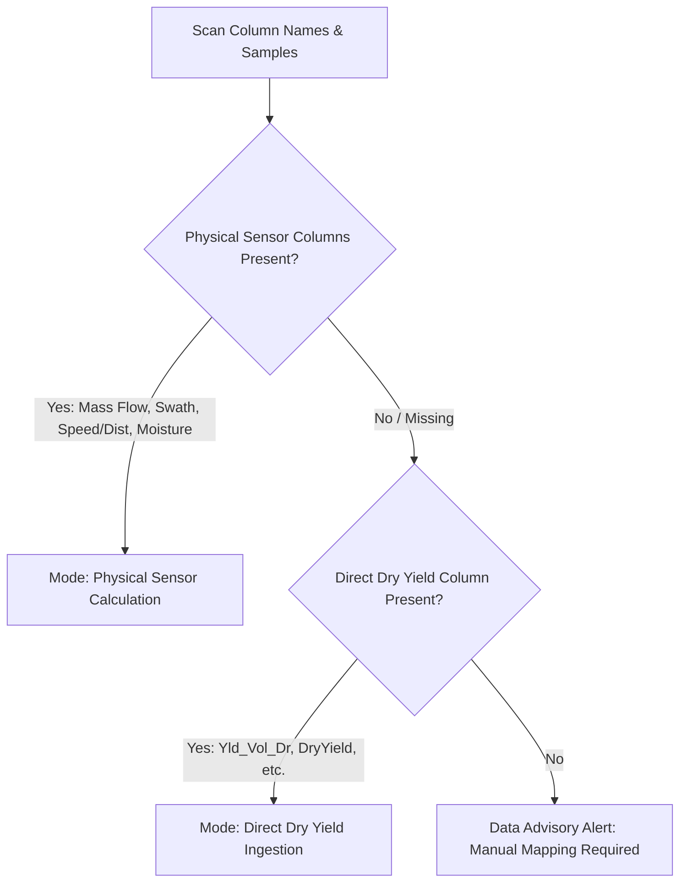

# Supported Input Formats & Column Mapping Guide

Yield Data Cleaner is designed to ingest yield data from any combine monitor, GIS software, or farm management system (FMS).

---

## Supported File Formats

| Format | Extension | Notes |
| :--- | :--- | :--- |
| **OGC GeoPackage** | `.gpkg` | Highly recommended; stores point vectors and full spatial indexing. |
| **ESRI Shapefile** | `.shp` | Standard industry export format; auto-detects `.dbf`, `.prj`, `.shx`. |
| **GeoJSON** | `.geojson`, `.json` | Standard WGS84 web geometry format. |
| **Delimited Text / CSV** | `.csv`, `.txt`, `.tsv`, `.dat` | Auto-detects delimiters (comma, tab, semicolon) and coordinate pairs. |
| **QGIS In-Memory Layers** | Memory vector | Directly reads scratch and temporary layers from the active QGIS session. |

---

## Column Detection Heuristics

When a layer or file is loaded, the tool scans all column names and data ranges to suggest mappings:

### Canonical Mapping Attributes

1. **Dry Yield (`yield`)**:
   - Priority heuristic looks for volumetric rate fields such as `Yld_Vol_Dr`, `DryYield`, `YIELD_BUAC`, `YLD_MASS_D`, `Yld_Mass_D`.
   - Unit dropdown lets you specify `bu/ac`, `lb/ac`, `t/ha`, or `kg/ha`.
2. **Moisture (`moisture`)**:
   - Scanned for column names like `Moisture`, `GrainMoist`, `MST_PCT`, `MST_PCT_DR`, `PCT_MOIST`.
   - Value distribution validation expects percentage values between 5% and 45%.
3. **Speed / Velocity (`speed`)**:
   - Scanned for `Speed`, `GPS_Speed`, `Velocity`, `SPD_MPH`, `VEH_SPEED`.
   - Supports `mph`, `km/h`, `m/s`, or `ft/s`.
4. **Swath Width (`swath`)**:
   - Scanned for `Swath`, `Width`, `Header_Wid`, `SWATH_FT`, `CUT_WIDTH`.
   - Supports `ft`, `in`, `m`, `cm`.
5. **Pass / Track Identifier (`pass_id`)**:
   - Scanned for `Pass`, `Pass_ID`, `Track`, `Swath_Num`, `TRK_ID`.
   - If missing, reconstructed automatically during Phase 3.
6. **Timestamp / Date (`timestamp` / `time`)**:
   - Scanned for `Timestamp`, `Time`, `Date`, `UTC_TIME`, `GPS_TIME`, `ZTIME`.
7. **Elevation (`elevation`)**:
   - Scanned for `Elevation`, `Altitude`, `ELEV_FT`, `HEIGHT_M`.
8. **Header Status (`header_status`)**:
   - Scanned for `Header`, `Engaged`, `Cut_Status`, `HDR_ON`.

---

## Volumetric vs. Mass Yield Calculation

Yield monitors measure grain in either volumetric rate (bushels per acre) or mass rate (pounds per second or tonnes per hectare).

### 1. Physical Calculation Formula
When mass flow and sensor geometry are present:
$$\text{Yield (bu/ac)} = \frac{\text{Flow Rate (lb/s)} \times \left(1 - \frac{\text{Moisture} - \text{StdMoisture}}{100}\right)}{\text{TestWeight (lb/bu)}} \times \frac{43560}{\text{Speed (ft/s)} \times \text{Swath (ft)}}$$

### 2. Direct Volumetric Ingestion
When a pre-computed volumetric yield field like `Yld_Vol_Dr` is mapped, the tool validates the distribution against crop-specific agronomic norms (e.g. 100–300 bu/ac for corn, 30–90 bu/ac for soybeans) and applies non-destructive range and spatial filters directly.

---

## Vendor Presets

Yield Data Cleaner includes built-in recognition presets for major machinery manufacturers:

- **John Deere GreenStar / Generation 4 / Operations Center**: Pre-mapped for `Yld_Mass_D`, `Yld_Vol_Dr`, `Moisture`, `Speed`, `Swath`, `Track`.
- **Ag Leader InCommand / Insight / SMS**: Pre-mapped for `Dry Yield(bu/ac)`, `Moisture(%)`, `Speed(mph)`, `Swath Width(ft)`, `Pass Num`.
- **Case IH AFS / New Holland PLM**: Pre-mapped for `Yield_Dry`, `Moisture_Percent`, `GroundSpeed`, `Swath_Width`, `Swath_Number`.
- **Climate FieldView / Precision Planting YieldSense**: Pre-mapped for `yield`, `moisture`, `speed`, `swath_width`, `pass`.
