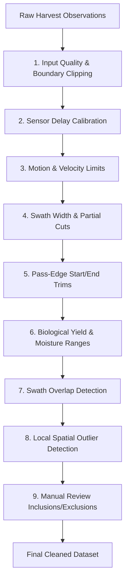

# Filter Methodology & Execution Order

Yield Data Cleaner uses non-destructive filtering. Every raw observation is retained in the master database with explicit reason flags, ensuring full auditability and reproducibility.

---

## Sequential Execution Order

Filters are applied in a strict, logically ordered pipeline:

---

## Filter Family Specifications

### 1. Input Quality & Boundary Clipping
- **`POS_INVALID`**: Excludes records with `NaN`, null, or out-of-range latitude/longitude.
- **`POS_DUPLICATE`**: Excludes duplicate observations recorded at the identical timestamp and location.
- **`OUTSIDE_BOUNDARY`**: Excludes points lying outside the confirmed field polygon boundary.

### 2. Sensor Delay Calibration
Combines have a physical lag between the moment grain is cut by the header and when it hits the mass flow impact plate and moisture sensor:
- **Flow Delay (s)**: Typical range 8–14 seconds. Shifts point coordinates or timestamps forward along the pass trajectory to align grain flow with actual harvest location.
- **Moisture Delay (s)**: Typical range 5–10 seconds. Adjusts moisture sensor readings to align with mass flow.

### 3. Motion & Velocity Limits
- **`SPEED_MIN`**: Excludes points below minimum harvesting speed (e.g. $< 1.0\text{ mph}$). When a combine stops or idles, grain continues to flow into the elevator, resulting in artificially high yield spikes.
- **`SPEED_MAX`**: Excludes points above realistic operating speed (e.g. $> 8.0\text{ mph}$), typical during transport or headland maneuvers.
- **`SPEED_RAPID_CHANGE`**: Excludes points experiencing sudden acceleration or deceleration ($> 2.5\text{ mph/s}$), which causes grain sloshing on the sensor plate.

### 4. Swath Width & Partial Cuts
- **`SWATH_MIN`**: Excludes observations recorded with zero or negligible swath width.
- **`SWATH_MAX`**: Excludes swaths wider than the physical header dimensions.
- **`HEADER_UP`**: Excludes points recorded while the header was raised.

### 5. Pass-Edge Start/End Trims
At the beginning of each pass, the combine threshing system fills with grain, creating a gradual ramp-up in measured yield. At the end of a pass, grain clears out, creating a ramp-down tail:
- **`PASS_START`**: Trims the first $N$ seconds or distance (e.g., first 10–25 ft) of each reconstructed pass.
- **`PASS_END`**: Trims the final $N$ seconds or distance of each pass.

### 6. Biological Yield & Moisture Ranges
- **`YIELD_RANGE_LOW` / `YIELD_RANGE_HIGH`**: Excludes values outside crop biological thresholds (e.g., corn $< 10\text{ bu/ac}$ or $> 350\text{ bu/ac}$).
- **`MOISTURE_RANGE_LOW` / `MOISTURE_RANGE_HIGH`**: Excludes values outside physical sensor accuracy thresholds (e.g., $< 8\%$ or $> 40\%$).

### 7. Swath Overlap Detection (`OVERLAP`)
When a combine harvests adjacent passes or cuts through point rows, the header may partially or completely overlap previously harvested terrain:
- Polygon footprints are generated for each point based on swath width and distance traveled.
- Points where the harvest area has already been cut by an earlier pass are flagged and excluded to prevent double-counting.

### 8. Local Spatial Outlier Detection (`LOCAL_OUTLIER`)
Yields vary spatially across a field due to soil, topography, and management zones. However, an isolated point with 300 bu/ac surrounded entirely by 100 bu/ac points is almost certainly a sensor artifact:
- Computes local moving-window neighborhood statistics (e.g., 20–40 nearest neighbors or within a 50–100 ft radius).
- Points deviating by more than $k$ standard deviations (or interquartile range multiples) from their local neighborhood median are flagged.
