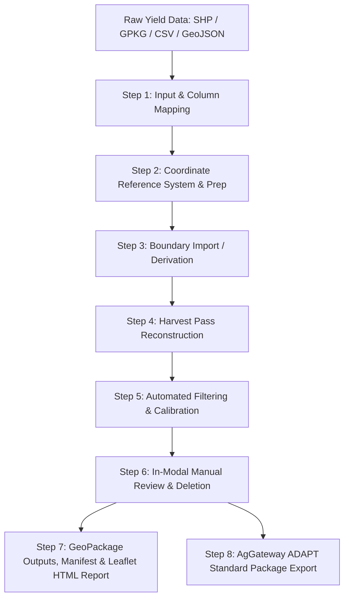

# Yield Data Cleaner — Documentation Hub

Welcome to the documentation for **Yield Data Cleaner**, an open-source QGIS plugin designed for inspecting, mapping, reviewing, and non-destructively cleaning combine yield-monitor data one field at a time.

Yield Data Cleaner reimagines the proven agronomic cleaning principles pioneered by the USDA-ARS *Yield Editor* software into a modern, auditable, geospatial Python/PyQGIS workflow with interactive map previews, reproducible recipes, and portable HTML review reports.

---

## Documentation Index

### Getting Started & User Guides
- **[User Guide](user_guide.md)**: Comprehensive walkthrough of the 4-tab interactive workflow dialog (Input & Prep, Boundary & Pass, Filter & Clean, Clean & Review) and the standalone Leaflet HTML Data Review web app.
- **[Supported Input Formats & Column Mapping](column_mapping.md)**: Guide on supported vector and tabular formats, automatic column recognition heuristics, calculation precedence, and vendor presets.
- **[Crop Profiles & Unit Systems](crops_and_units.md)**: Market standard moisture levels, bushel test weights, and conversion mathematics for Imperial and Metric units.

### Scientific Methodology & Algorithms
- **[Filter Methodology & Execution Order](filter_methodology.md)**: Deep dive into the 8 filter families, including sensor delays, swath overlaps, motion limits, and local spatial outlier detection.
- **[Field Boundary Derivation & Editing](boundary_derivation.md)**: How field boundaries are derived from swath footprints, smoothed/densified, interactively edited, and used for polygon clipping.
- **[QGIS Processing Algorithm Reference](processing_algorithms.md)**: Complete parameter and output specification for running Yield Data Cleaner headless or within QGIS Graphical Modeler workflows.

### Data Schemas & Interoperability
- **[Output Data Schema & Reason Codes](output_schema.md)**: Schema specification for the output GeoPackage, canonical layer attributes, and stable numeric reason codes for auditability.
- **[AgGateway ADAPT Interoperability](adapt_interoperability.md)**: Details on AgGateway ADAPT Standard JSON and GeoParquet export capabilities.

### Quality, Security & Compatibility
- **[Scientific Validation Report](validation_report.md)**: Benchmarking protocols, scientific agreement criteria, and comparison methodology against raw data and expert cleaning decisions.
- **[QGIS Compatibility & System Requirements](compatibility_report.md)**: Supported QGIS LTR versions (3.28+), Python requirements, and cross-platform OS matrix.
- **[Privacy & Data Security](privacy_and_security.md)**: Privacy statement regarding local-first execution, telemetry-free processing, and basemap tile access.

---

## Workflow Overview

