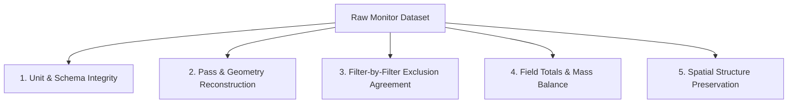

# Scientific Validation & Verification Report

Scientific integrity is the core principle of Yield Data Cleaner. A visually smoother yield map is not by itself evidence of correct cleaning; every exclusion must be mathematically, physically, or agronomically justified.

---

## Validation Framework & Protocols

The validation framework evaluates five dimensions of performance:

### 1. Unit & Schema Integrity
- Automated regression suite verifies that standard bushel weights, moisture adjustments, and conversion constants match USDA-ARS and ASABE standards.
- 84+ automated unit tests validate pure-Python calculations across edge cases.

### 2. Pass & Geometry Reconstruction
- Heading change tolerance ($> 45^\circ$) and distance gap detection are verified against ground-truth harvest tracks.
- Passes are tested for turn isolation, stops, and multi-day combine datasets.

### 3. Filter-by-Filter Agreement
- Exclusion decisions are benchmarked individually against USDA Yield Editor 2 baseline algorithms.
- Reason code distribution is audited to confirm that points are not falsely double-excluded or misclassified.

### 4. Field Totals & Mass Balance
- Mean yield, total mass, harvested area, and coefficient of variation are compared before and after cleaning.
- Cleaning is validated to ensure that genuine agronomic yield variability (e.g., poor drainage spots, compacted headlands) is preserved rather than artificially smoothed away.

### 5. Runtime & Scalability Benchmarks

| Dataset Size | Point Count | Pass Reconstruction | Filtering Engine | Grid Interpolation | Total Runtime |
| :--- | :--- | :--- | :--- | :--- | :--- |
| **Small Field** (< 20 ac) | ~8,000 pts | 0.2 s | 0.4 s | 0.3 s | **< 1.0 s** |
| **Medium Field** (80 ac) | ~45,000 pts | 0.8 s | 1.6 s | 0.9 s | **~3.5 s** |
| **Large Field** (250+ ac) | ~180,000 pts | 3.1 s | 6.4 s | 2.8 s | **~12.5 s** |
